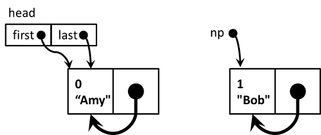
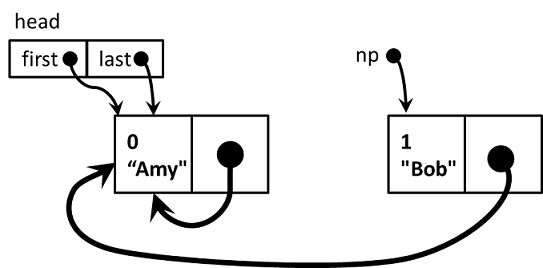
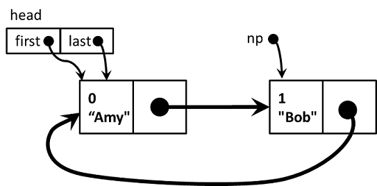
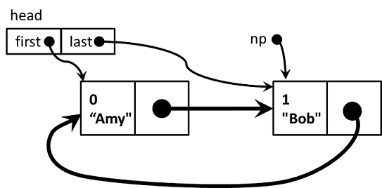

# Linked Lists

我們可以利用 C 語言的指標 (pointers)，將資料串起來，造出 linked list 這種資料結構。最標準的形式是 singly linked list，長得像底下這樣：

Singly linked list (from wikipedia)


最後面的方框代表`NULL`，用來標記 linked list 的結尾。

也可以讓最後一筆資料再接回開頭，形成環狀的結構，像底下這樣：

Circular linked list (from wikipedia)


## Singly Linked List 實作

首先要定義底層的資料型態，假設我們想記錄的每一筆資料，都是由一個整數欄位和一個字串組成，在 C 語言裡面我的通常使用`struct`搭配`typedef`來達成，我們替它取個簡化的名字叫做`List`。其中`id`和`str`都是要儲存的資料，`next`則是指向`List`結構的指標。透過`next`我們就能讓每筆資料記住下一筆資料的位址，進而將所有的資料串連。
```C
typedef struct t_List {
    int id;
    char str[10];
    struct t_List* next;
} List;
```

定義了`struct`，接下來就要想想看需要哪些函數，讓我們能對這樣的 linked list 做一些基本的操作，例如
```C
List* getData(void);
List* addToLast(List* head, List* np);
List* removeFirst(List* head);
void showList(List* lst);
List* freeList(List* lst);
```
### 讀取資料

首先要能夠讀取資料並存放到`List`裡面，我們把`getData`定成
```C
List* getData(void)
{
    List* np;
    static int ID;

    np = (List *) malloc(sizeof(List));
    if (np!=NULL) {
        printf("Enter a name: ");
        if (scanf("%9s", np->str)==1) {
            np->id = ID++;
            np->next = NULL;
        } else {
            free(np);
            np = NULL;
        }
    }
    return np;
}
```
主要是用`malloc`取得一塊足夠存放我們自定的`struct` (也就是`List`) 所需的空間，將這個空間的位址用指標變數`np`記住。如果`malloc`失敗了，無法取得空間，`np`的值會是`NULL`，這種情況就甚麼都不能做，直接`return np`，也就是`return NULL`。如果`malloc`確實能夠取得足夠的空間，則`np`的值不會是`NULL`，而是取得的那塊記憶體的位址。因此，接下來就可以讀取資料，把資料存到`struct`的對應欄位中。假設我們讓使用者輸入一個長度不超過九個字元的字串，用`scanf`讀取並存到`str`欄位裡，如果使用者確實出入了一個合法的字串，我們就繼續設定其他欄位，包括`id`和`next`。其中`id`的值是從`static`變數`ID`取得，`ID`的值每次會增加一，而且由於`ID`是`static`變數，所以`getData`函數結束之後`ID`並不會消失，下次`getData`再被呼叫的時候，我們就可以繼續使用`ID`並取得當時保存的數值。至於`next`，我們就先讓它指向`NULL`。這樣後函數最後`return np;`就會把新產生的`List`的位址傳回去。

如果使用者不想輸入，按`Ctrl-Z` `Enter`結束，這種情況就應該把剛才用`malloc`取得的記憶體，再用`free`還回去，並且把`np`的值設為`NULL`，表示沒有讀到任何資料。

順便回顧一下，`np->id`也可以寫成`(*np).id`，也就是先用`*`符號，取得指標記住的位址裡面所存放的`struct`資料，然後再用`.`符號取得對應的欄位。雖然兩種寫法都可以，但是一般都會採用`np->id`的寫法，比較簡潔。

### 在既有的 linked list 加入或移除資料

接下來我們來寫底下這兩個函數，分別是把一筆新的資料加入既有的 linked list 的最後面，以及把原有的 linked list 的第一筆資料移除。這種 linked list 運作方式很像排隊，所以通常稱作 queue。這裡只是舉例，當然也可已依照需求，用其他的規則加入資料，例如把資料加在 linked list 的開頭位置，移除時也從開頭移除，對應的程式寫法就稍有不同。我們主要只是要用這個例子，來示範如何調整指標，達到我們想要的加入或移除的效果。
```C
List* addToLast(List* head, List* np);
List* removeFirst(List* head);
```
先看看`List* addToLast(List* head, List* np);`該怎麼寫
```C
List* addToLast(List* head, List* np)
{
    List* ptr = head;
    if (head==NULL) {
        head = np;
    } else {
        while (ptr->next != NULL) {
            ptr = ptr->next;
        }
        ptr->next = np;
    }
    return head;
}
```
傳入的兩個參數都是指標，第一個指標`head`指向要被修改的`List`，第二個指標`np`則是指向要被加入的資料，我們想將`np`所指到的資料加入`head`所指到的`List`的最後面。
1. 假如`head`是`NULL`，也就是原本的`List`是空的，這種情況就讓`head`指向`np`所指的那筆資料，如此一來就有等於得到了一個`List`，而且這個`List`只包含一筆資料。
2. 假如`head`所指到的`List`原本已經有資料，則要先從頭開始，走到`List`的最後，我們利用迴圈來達成 (如下面的程式碼) 。一開始 `ptr = head`，然後持續做 `ptr = ptr->next`，讓指標移到下一筆資料所在的位址，當指標找到最後一筆資料，這時候 `ptr->next` 的值應該會是 `NULL`，所以迴圈可以停止，然後做 `ptr->next = np;` 把新的資料加在原有的最後一筆資料後面。(我們已經假定 `np->next` 會是 `NULL`，所以整個 `List` 經過 `addToLast` 後，仍然是一個具備正常結尾的 `List`。)
```C
while (ptr->next != NULL) {
    ptr = ptr->next;
}
```
3. 最後做 `return head;`，將新增資料之後的 `List` 的開頭位址傳回去。

再來是`List* removeFirst(List* head)`，將`List`的第一筆資料移除。
```C
List* removeFirst(List* head)
{
    List *ptr;
    if (head == NULL) return NULL;
    else {
        ptr = head->next;
        free(head);
        return ptr;
    }
}
```
傳入的參數是`List`的開頭位址，傳回去的則是拿掉第一筆資料之後，剩下的`List`的開頭位址。
1. 如果原本的`List`是空的，就甚麼都不做，`return NULL;`
2. 否則`List`裡面至少有一筆資料，先用另一個指標`ptr`記住下一筆資料的位址 (下一筆資料的位址也有可能是`NULL`；假如`List`裡只有一筆資料，則`head->next`會是`NULL`)，做完`ptr = head->next`之後，就可以放心地把`head`所指到的那筆資料，透過呼叫`free(head);`移除。
3. 最後把`ptr`記住的位址傳回去，`return ptr;`，成為`List`的新的開頭位址。


### 顯示 linked list 的內容

接下來要寫的函數是`void showList(List* lst);`做法很簡單，只要用迴圈把整個 linked list 走過一遍，依序將每一筆資料的內容顯示出來就行了。
```C
void showList(List *lst)
{
	printf("[");
	while (lst != NULL) {
		printf("%d:%s,", lst->id, lst->str);
		lst = lst->next;
	}
	printf("]\n");
}
```
關鍵還是`lst = lst->next;`這句。

### 清除整個 linked list

利用前面已經寫好的`removeFirst`
```C
List* freeList(List* lst)
{
    while (lst!=NULL) {
        lst = removeFirst(lst);
    }
    return NULL;
}
```

### 完整的成示範利及執行效果
```C
#include <stdio.h>
#include <stdlib.h>

typedef struct t_List {
    int id;
    char str[10];
    struct t_List* next;
} List;

List* getData(void);
List* addToLast(List* head, List* np);
List* removeFirst(List* head);
void showList(List* lst);
List* freeList(List* lst);

int main(void)
{
    List* head = NULL;
    List* np = NULL;

    while((np = getData()) != NULL) {
        head = addToLast(head, np);
        showList(head);
    }
    showList(head);
    head = removeFirst(head);
    showList(head);
    head = freeList(head);
    return 0;
}

List* getData(void)
{
    List* np;
    static int ID;

    np = (List *) malloc(sizeof(List));
    if (np!=NULL) {
        printf("Enter a name: ");
        if (scanf("%9s", np->str)==1) {
            np->id = ID++;
            np->next = NULL;
        } else {
            free(np);
            np = NULL;
        }
    }
    return np;
}

List* addToLast(List* head, List* np)
{
    List* ptr = head;
    if (head==NULL) {
        head = np;
    } else {
        while (ptr->next != NULL) {
            ptr = ptr->next;
        }
        ptr->next = np;
    }
    return head;
}

List* removeFirst(List* head)
{
    List *ptr;
    if (head==NULL) return NULL;
    else {
        ptr = head->next;
        free(head);
        return ptr;
    }
}

void showList(List *lst)
{
    printf("[");
    while (lst != NULL) {
        printf("%d:%s,", lst->id, lst->str);
        lst = lst->next;
    }
    printf("]\n");
}

List* freeList(List* lst)
{
    while (lst!=NULL) {
        lst = removeFirst(lst);
    }
    return NULL;
}
```

相關的函數前面都已經解釋過了，只剩下`main`要再稍微看看。其中讀取資料的方式是
```C
while((np = getData()) != NULL) {
    head = addToLast(head, np);
    showList(head);
}
```
每次把新的`np`加到原本的`head`所指到的`List`的最後面，然後再呼叫`showList`把目前的狀態顯示出來。
*有一個細節非常重要，必須特別注意*：在`main`的開頭`List* head = NULL;`，一定要記得設定初值`NULL`，因為之後呼叫`addToLast`會來當作判斷依據，如果沒有設定初值，程式會當掉

之後還有`head = removeFirst(head);`把第一筆資料移除，並且更新`head`指標。最後是
```C
head = freeList(head);
```
將整個`List`清除，並且把`head`設為`NULL`表示是空的`List`。

### *執行過程*
```
Enter a name: amy
[0:amy,]
Enter a name: bob
[0:amy,1:bob,]
Enter a name: cathy
[0:amy,1:bob,2:cathy,]
Enter a name: danny
[0:amy,1:bob,2:cathy,3:danny,]
Enter a name: ^Z
[0:amy,1:bob,2:cathy,3:danny,]
[1:bob,2:cathy,3:danny,]
```

## Circular Linked List 實作

Circular linked list 的最後一筆資料會再接回第一筆資料，而非指向`NULL`。每次加入或移除資料之後，都必須保持 circurlar 的性質，不能讓 linked list 斷掉。

為了操作方便，除了既有的資料結構，我們另外定了一個 sentinel node，包含兩個指標`first`和`last`，分別指向第一筆和最後一筆資料。
```C
typedef struct t_List {
	int id;
	char str[10];
	struct t_List* next;
} List;

typedef struct {
	List* first;
	List* last;
} Head;
```

需要定義的函數包括
```C
List* getData(void);
Head addToLast(Head head, List* np);
Head removeFirst(Head head);
void showList(Head head);
Head freeList(Head head);
```

### 讀取資料

首先是`getData`
```
List* getData(void)
{
    List* np;
    static int id;
    np = (List *) malloc(sizeof(List));
    if (np!=NULL) {
        printf("Enter a name: ");
        if (scanf("%9s", np->str)==1) {
            np->id = id++;
            np->next = np;  // 這一行不一樣，指向自己而不是NULL
        } else {
            free(np);
            np = NULL;
        }
    }
    return np;
}
```
和 singly linked list 的版本只有一個地方不同，原本是`np->next = NULL;`改成`np->next = np;`，這樣新產生的只有一筆資料的`List`，`next`指標指回自己。


---

`main`的內容如下
```C
int main(void)
{
    Head head;
    List* np = NULL;

    head.first = head.last = NULL;
    while((np = getData()) != NULL) {
        head = addToLast(head, np);
        showList(head);
    }
    showList(head);
    head = removeFirst(head);
    showList(head);
    head = freeList(head);
    return 0;
}
```
注意到`Head head;`是一個一般的變數而不是指標，不過`head`包含的兩個欄位`head.first`和`head.last`都是指向`List`的指標。一開始必須手動把兩個指標都設定為`NULL`，也就是`head.first = head.last = NULL;`


### 在既有的 circular linked list 加入或移除資料

由於我們有兩個指標可以同時記住開頭和結尾，事情會變得簡單很多。先來看`addToLast`：
```C
Head addToLast(Head head, List* np)
{
	if (head.last == NULL) {
    	head.first = head.last = np;
	} else {
    	np->next = head.first;
    	(head.last)->next = np;
    	head.last = np;
	}
	return head;
}
```
傳入的參數是`head`和`np`。由於`head`裡面藏了兩個指標`first`和 `last`，我們利用這兩個指標就能輕鬆把`np`加入既有的`List`的結尾，並且維持原有的 circular 性質。

1. 如果傳入的`head.last`指標的值是`NULL`，表示原本的 cirular linked list 是空的，這時候`np`就成了第一筆資料，同時也是最後一筆資料，因此`head.first = head.last = np;`。
2. 否則原有的 circular linked list 已經有其他資料，那就要找到最後一筆資料，並將`np`接在其後。由於要維持 circular 性質，所以還必須讓`np->next`指向第一筆資料。我們用底下三行程式來達成
```C
np->next = head.first;
(head.last)->next = np;
head.last = np;
```

用圖形表示上列步驟，










有了 `first` 和 `last`，把資料移除的做法也變得簡單許多。
```C
Head removeFirst(Head head)
{
    if (head.first != NULL)  {
        if (head.first == head.last) {
            free(head.first);
            head.first = head.last = NULL;
        } else {
            (head.last)->next = (head.first)->next;
            free(head.first);
            head.first = (head.last)->next;
        }
    }
    return head;
}
```
1. 如果`head.first`不是`NULL`才有移除的必要，否則就直接`return head;`
2. 接下來分成兩種情況：
2.1 如果只有一筆資料，也就是`head.first == head.last`，就把那筆資料移除，`free(head.first)`。移除之後，`List`變成空的，所以要設定`head.first = NULL;`而且`head.last = NULL;`。最後會把更新過後的`head`傳回去。
2.2 如果有超過一筆資料，則`head.first`和`head.last`會各自指向不同的地方，這時候的移除需要三個步驟 (如下面的程式碼) ，順序不能亂掉，否則會遺失需要的資訊。
2.2.1 先是把`(head.last)->next`(原本只到第一筆資料)，改成指向第二筆資料。第二筆資料的位址可以用 `(head.first)->next` 取得。
2.2.2 再來就可以把第一筆資料去掉，`free(head.first);`
2.2.3 然後更新 `head.first`，讓它指向原本的第二筆資料 (現在變成了第一筆資料)，該筆資料的位址我們剛才已經用 `(head.last)->next` 記住。

```C
(head.last)->next = (head.first)->next;
free(head.first);
head.first = (head.last)->next;
```

上述的步驟就不再用圖形來說明，但是大家可以自己試著畫畫看，對於理解操作流程會有幫助。

### 顯示 linked list 的內容
```C
void showList(Head head)
{
    List* lst = head.first;
    if (lst==NULL) printf("[]\n");
    else {
        printf("[");
        do {
            printf("%d:%s,", lst->id, lst->str);
            lst = lst->next;
        } while (lst != head.first);
        printf("]\n");
    }
}
```
### 清除整個 linked list
```C
Head freeList(Head head)
{
    while (head.first != NULL) {
        head = removeFirst(head);
    }
    return head;
}
```
完整的程式碼就不再貼出來占空間。如果想要測試，只要把上面程式碼片段整合在一起，一併編譯就行了。程式的執行結果和 singly linked list 版本相同。

## 將資料和 linked list 分開儲存

最後再補上一個範例，用 linked list 來實作以 cons 方式構成的 list。在這個例子中，我們將資料和 linked list 分開儲存，另外用指標指向實際資料所在位址。由於時間的關係，這個例子應該不會在上課的時候講解，有興趣請自行研究。不過，無論如何，前面兩個例子，singly linked list 以及 circular linked list，一定要搞懂，而且要能夠自己寫出來才行。
```C
#include <stdio.h>
#include <stdlib.h>

typedef struct {
    int id;
    char str[10];
} Node;

typedef struct t_List {
    Node* data;              // 透過指標，記住資料所在位址
    struct t_List* next;
} List;

Node* createNode(void);      // 用來產生資料
List* cons(Node* nodep, List* lst);   // cons 將資料加在 List 最前面   cons head tail
void showList(List* lst);
void freeList(List* lst);
Node* head(List* lst);       // 取得 List 第一筆資料
List* tail(List* lst);       // 取得扣除第一筆資料之後 剩下的 List

int main(void)
{
    Node* np = NULL;
    List* lst = NULL;

    while((np = createNode()) != NULL) {
        lst = cons(np, lst);  // 不斷用 cons 把新讀取的資料加在既有的 List 前面
        showList(lst);
    }
    showList(lst);

    printf("%d: %s\n", head(lst)->id, head(lst)->str);
    showList(tail(lst));
    freeList(lst);
    return 0;
}

Node* createNode(void)
{
    Node* nodep;
    static int id;

    nodep = (Node *) malloc(sizeof(Node));
    if (nodep!=NULL) {
        printf("Enter a name: ");
        if (scanf("%9s", nodep->str)==1) {
            nodep->id = id++;
        } else {
            free(nodep);
            nodep = NULL;
        }
    }
    return nodep;
}

List* cons(Node* nodep, List* lst)
{
    List* hp;
    if (nodep==NULL) return lst;
    else {
        hp = (List*) malloc(sizeof(List));   // 產生一個 List 結構  並且用指標 hp 記住位址
        hp->data = nodep;                    // 把其中的 data 指標指向 nodep 這筆資料
        hp->next = lst;                      // 把 next 指標指向 既有的 lst
        return hp;                           // 把 hp 所記住的位址傳回去
    }
}

void showList(List *lst)
{
    printf("[");
    while (lst != NULL) {
        printf("%d:%s,", lst->data->id, lst->data->str);
        lst = lst->next;
    }
    printf("]\n");
}

void freeListHelper1(List* lst)
{
    while (lst != NULL) {
        if (lst->data != NULL) {
            free(lst->data);
            lst->data = NULL;
        }
        lst = lst->next;
    }
}

void freeListHelper2(List* lst)
{
    if (lst == NULL) return;
    else {
        freeListHelper2(lst->next);
        free(lst);
    }
}

void freeList(List* lst)
    {
    freeListHelper1(lst);   // free 要分成兩步驟， 先把 List 裡面記住的每筆資料清除
    freeListHelper2(lst);   // 再把 List 本身清除
}

Node* head(List *lst)
{
    if (lst != NULL)
        return lst->data;
    else
        return NULL;
}

List* tail(List *lst)
{
    if (lst != NULL)
        return lst->next;
    else
        return NULL;
}
```
